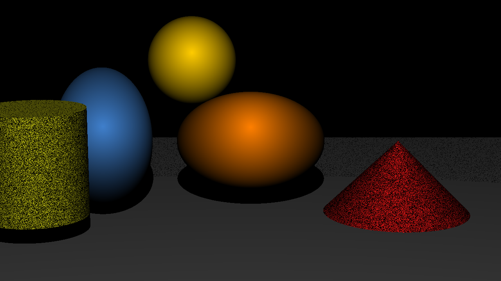
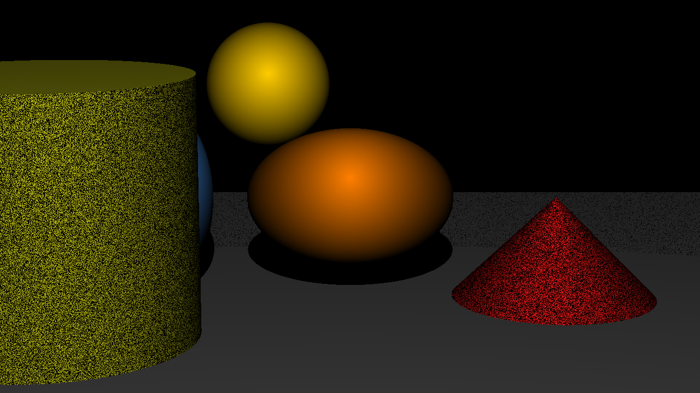
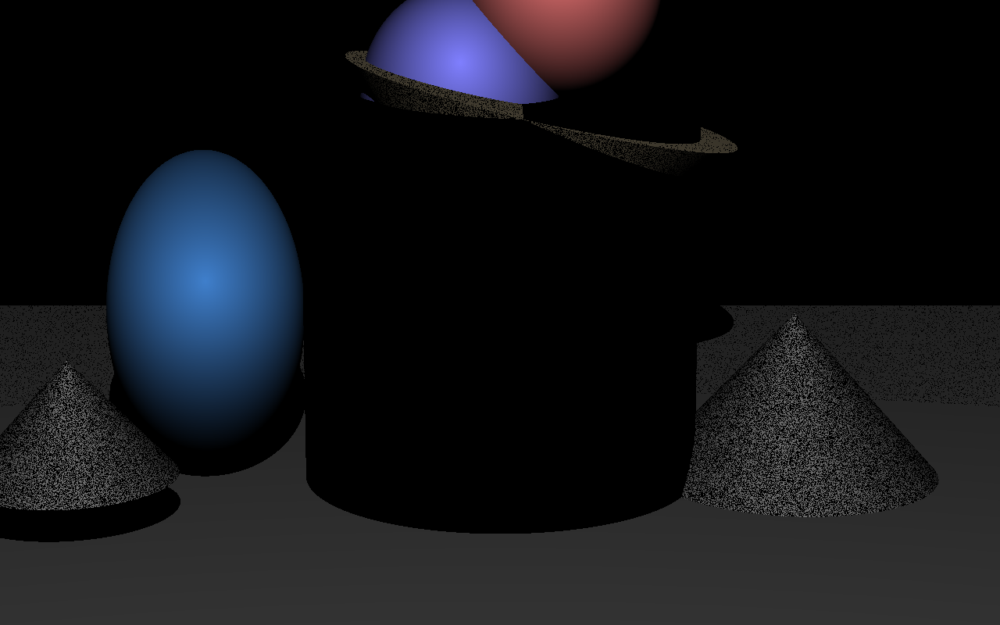
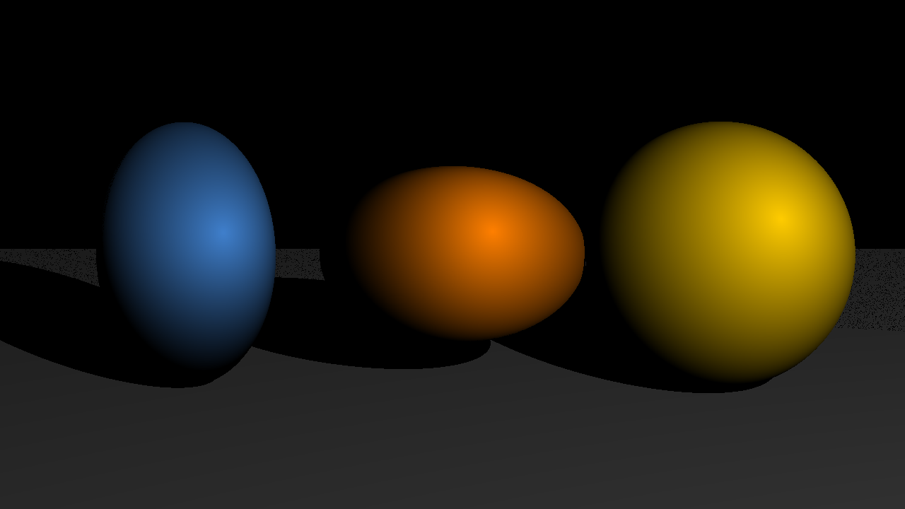
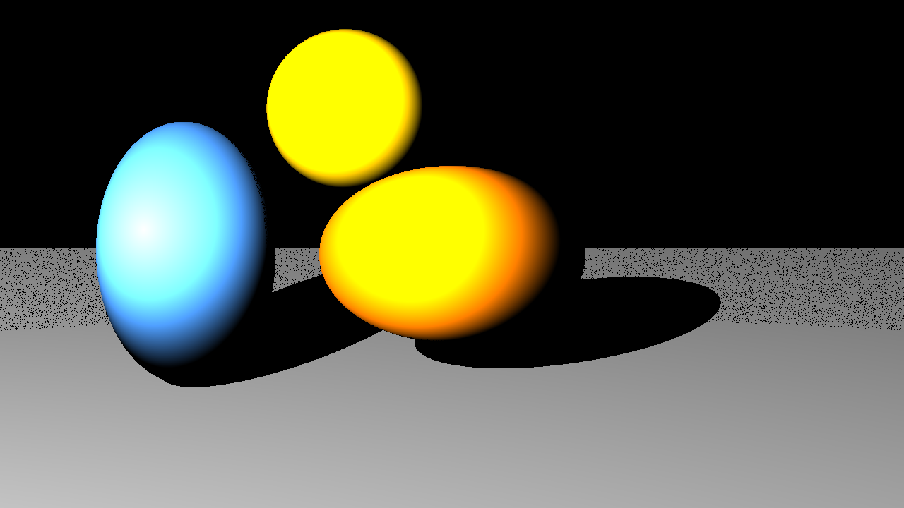

# Raytracer

A CPU ray tracer written in modern C++ that renders 3D scenes described in a configuration file to PPM images.



## About

Built in 2023. Ray tracing generates images by casting a ray from the camera through each pixel and simulating how it interacts with the objects and lights of the scene. The goal was to build an extensible renderer in object-oriented C++, with scenes loaded from a `libconfig` file and new primitives easy to plug in through interfaces and design patterns.

## Features

- **Primitives**: spheres, infinite planes, cones and cylinders, each with its own ray–object intersection test.
- **Transformations**: translation, rotation and scaling through 4×4 homogeneous matrices (forward and inverse transforms applied to rays).
- **Lighting**: point light with Lambertian (diffuse) shading.
- **Hard shadows**: shadow rays are cast from each hit point toward the light.
- **Configurable camera**: resolution, position, look-at and field of view.
- **Scene files** parsed with `libconfig++` (camera, primitives with position / rotation / scale / colour, light settings).
- **Composite object** ("ice cream": a sphere on a cone) assembled with the Builder / Director patterns.
- Output written as a PPM image in `screenshots/`.

## Tech stack

- C++20, `g++`
- [libconfig++](https://hyperrealm.github.io/libconfig/) for scene parsing
- SDL2 headers
- GNU Make

## Architecture

```
src/
├── main.cpp              CLI entry point: parse the scene, render, write the image
├── parsing/              Parsing_OBJ — reads the libconfig scene file
├── camera/               Camera (ray generation), Ray, Scene (object list + render loop)
├── object/               IObject / AObject → Sphere, Plane, Cone, Cylinder; Transform
├── light/                ILight / ALight → PointLight (diffuse + shadow rays)
├── algo/                 Vector and Matrix maths
├── image/                Image buffer + Color, PPM export
└── design_patern/        Factory (objects, lights), Builder + Director (composite objects)
scenes/config.cfg         Example scene
```

Rendering pipeline: `scene file → Parsing_OBJ → Scene (Factory builds objects / lights) → Camera casts one ray per pixel → closest intersection → light & shadow computation → Image → PPM`.

## Build & Run

Requirements: `g++` with C++20 support, `make`, `libconfig++` and SDL2 development headers.

```bash
# Debian / Ubuntu
sudo apt install g++ make libconfig++-dev libsdl2-dev
```

```bash
make                            # builds ./raytracer
make debug                      # build with debug symbols
make fclean                     # remove objects and binary
```

```bash
./raytracer scenes/config.cfg   # writes screenshots/config.ppm
./raytracer --help
```

Example scene excerpt (`scenes/config.cfg`):

```
camera : {
    resolution = { width = 1280; height = 800; };
    position = { x = 0; y = -10; z = -2; };
    fieldOfView = 72.0;
};
primitives : {
    spheres = (
        { x = -1.5; y = 0.0; z = 0.0; r = 0; color = { r = 0.25; g = 0.5; b = 0.8; };
          scale_x = 0.5; scale_y = 0.5; scale_z = 0.75; }
    );
    planes = ( { axis = 3; position = -20; color = { r = 0.5; g = 0.5; b = 0.5; }; } );
};
```

## Gallery

| | |
|---|---|
|  |  |
|  |  |
